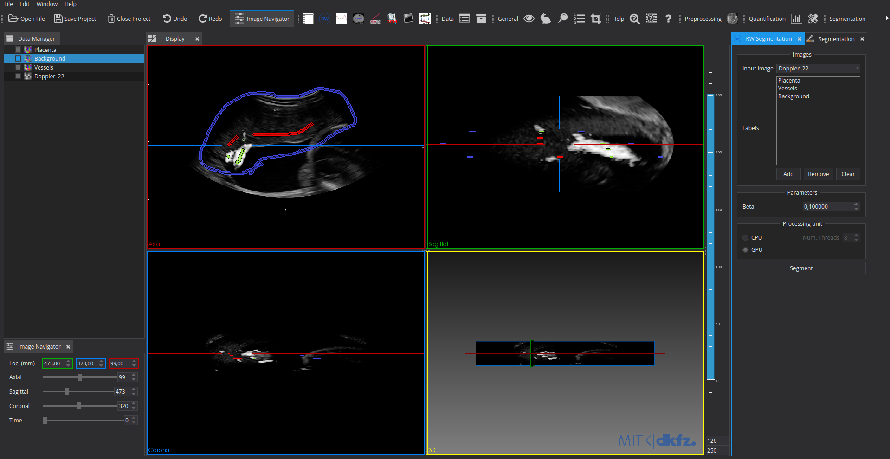

**Description:** 

  This is a MITK plug-in that performs a random walker (RW) segmentation on 
  2D and 3D (medical) images which can be executed on a CPU and a GPU.
  It is based on the algorithm provided by Grady (2006) [1]. 

  [1] L. Grady, “Random Walks for Image Segmentation,”IEEE 
      Transactions on Pattern Analysis and Machine Intelligence, 
      vol. 28, no. 11, pp. 1768–1783, nov 2006.

  The plug-in allows the user to select the image that they want to segment,
  as well as a single multi-label prior image, or multiple single-label prior images.
  The algorithm will return a segmentation image with all the labels (the highest 
  value label will be assigned a value of 0).
  Additionally, a GPU RW solver will also be installed if the user has
  CUDA in their system. Otherwise, only a CPU solver will be available.
  In any case, the user can specify how many threads the CPU solver can 
  use.

  If no UI is required, the core RW filters (CPU and GPU) can be found here:

  - https://github.com/enricperera/itkRWSegmentationFilter

  Following you can find the homepages for the libraries used, and the versions which have been used during the development, although other versions might also work.

  - MITK (2018.04.2): https://github.com/MITK/MITK
  - Eigen3 (3.3.4-4): http://eigen.tuxfamily.org/index.php?title=Main_Page#Download
  - OpenMP: https://www.openmp.org/resources/openmp-compilers-tools/
  - CUDA Toolkit (9.1): https://developer.nvidia.com/cuda-toolkit 

**Plugin screenshot:**

**Build:**

  Clone or download repository and enter the download folder.

    git clone https://github.com/enricperera/mitkRWSegmentationPlugin.git
    cd mitkRWSegmentationPlugin

  Create a new "build" directory. Configure and compile source. CUDA and Eigen3 are detected automatically if installed in /usr. Otherwise, specify their path.

    mkdir build
    cmake ../ -DEXTERNAL_MITK_DIR=path/to/mitk/build/dir
    make

  Run and start segmenting images.

    ./mitkRWSegmentationPlugin-build/bin/RWSegmentation
